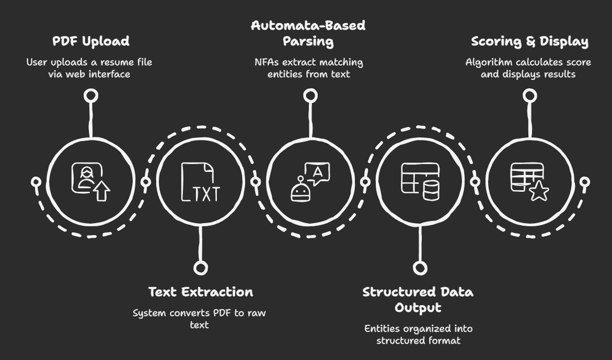

# 🤖 REGEX / AUTOMATA-BASED NAMED ENTITY RECOGNITION (NER)

A web application that demonstrates the principles of Formal Language and Automata Theory by parsing PDF resumes to extract structured information without using any machine learning.

This project was developed as a final project for the **Formal Language and Automata Theory** course, showcasing the practical application of finite automata (DFA/NFA) in solving real-world Natural Language Processing tasks.

📜 **Table of Contents**
* [🎯 About the Project](#-about-the-project)
* [✨ Features](#-features)
* [📊 Methodology](#-methodology)
* [🛠 Application and Tools Used](#-application-and-tools-used)
* [🗂 Project Structure](#-project-structure)
* [🚀 How to Run](#-how-to-run)
* [📚 References](#-references)

---
### 🎯 About the Project

The Automata-Based NER system provides a fully functional web portal to parse resumes with the following main goals:
* Apply the theoretical concepts of finite automata to a practical information extraction problem.
* Automatically parse unstructured PDF resumes to extract key, structured entities.
* Calculate a heuristic-based "resume score" based on the completeness of the extracted data.
* Adhere to the core academic constraint of using **only automata-based patterns**, with no machine learning libraries.

---
### ✨ Features

* **🤖 Automata-Based Parser:** The core engine uses a bank of precisely defined NFAs (implemented as Regular Expressions) to extract:
    * Candidate Name
    * Contact Information (Email, Phone, LinkedIn)
    * CGPA
    * A comprehensive list of technical skills.
    * Project titles from the projects section.
* **💯 Resume Scoring Algorithm:** A rule-based system that assigns a score to the resume based on the quantity and quality of the information found.
* **🔍 Text Highlighter Tool:** A secondary utility that allows users to upload any document or paste text and dynamically highlight all occurrences of a search term, demonstrating a simple string-matching DFA.
* **🌐 Interactive Web Interface:** A clean and modern user interface built with Flask that allows for easy PDF uploads and clear presentation of the extracted results.
* **🚫 No Machine Learning:** The entire project is a testament to the power of formal language theory, built purely with automata.

---
### 📊 Methodology

The system follows a simple pipeline to process resumes and extract entities.

*Your methodology diagram will be displayed here.*


---
### 🛠 Application and Tools Used

* **Backend:**
    * **🐍 Python:** The core programming language.
    * **Flask:** A lightweight web framework to serve the application.
    * **PyMuPDF (`fitz`):** A powerful library for extracting raw text from PDF documents.
* **Frontend:**
    * **HTML5:** For the structure of the web pages.
    * **CSS3:** For all custom styling, layout, and responsiveness.
    * **JavaScript:** For the dynamic sliding effect in the navigation bar.
* **Core Logic:**
    * **Regular Expressions:** The practical implementation of our Finite Automata for pattern matching.

---
### 🗂 Project Structure
```bash
/ResumeParserWebsite
├── app.py              # Main Flask application file
├── parser.py           # All resume parsing logic and automata definitions
├── uploads/            # Temporary folder for uploaded files
└── templates/
        ├── index.html      # Single HTML file for the entire frontend UI
```
---
### 🚀 How to Run

1.  **Clone the Repository**
    ```sh
    git clone [https://github.com/your-username/your-repo-name.git](https://github.com/your-username/your-repo-name.git)
    cd ResumeParserWebsite
    ```

2.  **Set up a Virtual Environment (Recommended)**
    ```sh
    python -m venv venv
    source venv/bin/activate  # On Windows, use `venv\Scripts\activate`
    ```

3.  **Install Dependencies**
    ```sh
    pip install Flask PyMuPDF
    ```

4.  **Run the Flask Application**
    ```sh
    python app.py
    ```

5.  **Open the Website**
    * Navigate to **`http://127.0.0.1:5000/`** in your web browser.
    * You can now upload PDF resumes to the "Resume Parser" or use the "Text Highlighter" tool.

---
### 📚 References

* [Python Documentation](https://docs.python.org/3/)
* [Flask Documentation](https://flask.palletsprojects.com/)
* [PyMuPDF Documentation](https://pymupdf.readthedocs.io/)

---
🏆 Thank you for reviewing this project!
